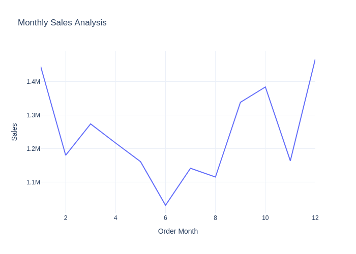
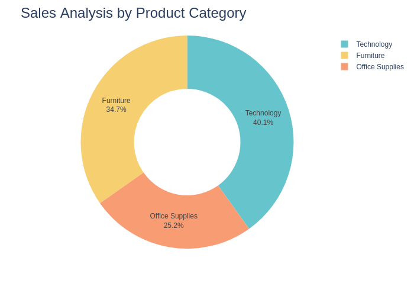
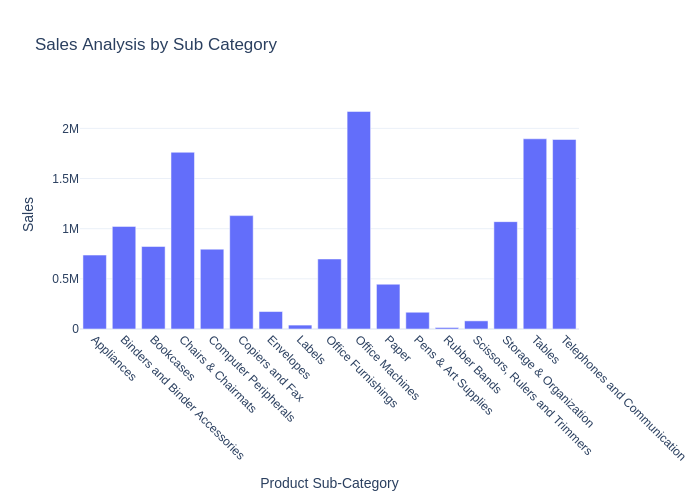
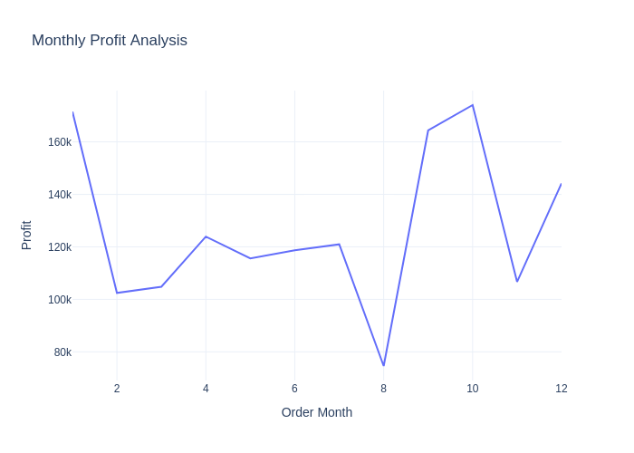
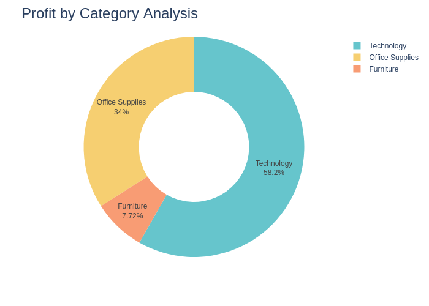
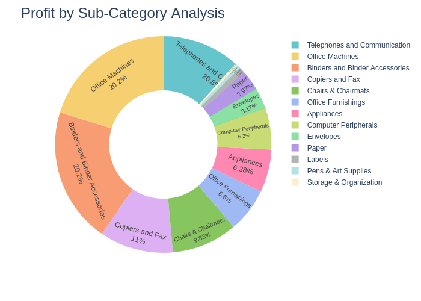
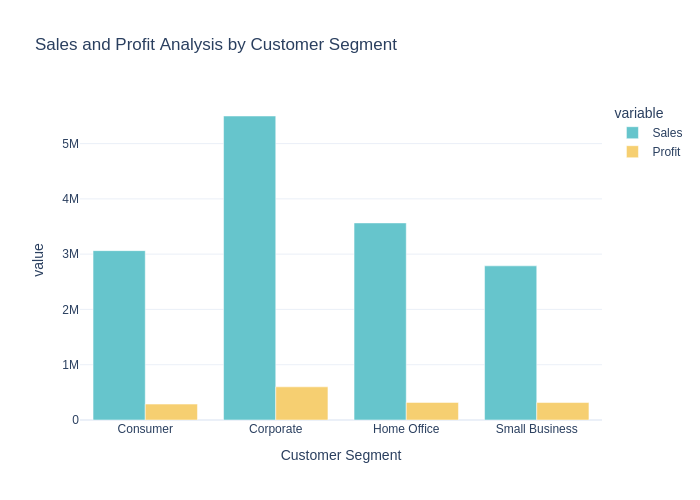

# Walmart Sales & Profitability Analysis

## Project Overview
Retail companies like Walmart generate massive sales volumes, but **high revenue does not always mean high profitability**.  
This project analyzes Walmart sales data to uncover **true profit drivers**, identify **inefficient revenue streams**, and provide **actionable business recommendations** using data.

The focus is not just *what sells*, but *what actually makes money*.

---

## Business Problem
Walmart operates across multiple:
- product categories
- sub-categories
- customer segments
- seasons

However:
- Some high-sales products deliver low profit
- Certain customer segments generate inefficient revenue
- Profitability varies significantly across time and product mix

**Key Question:**  
> Where should Walmart focus to improve profitability *without increasing sales volume*?

---

## Business Objectives
- Analyze **sales and profit trends over time**
- Identify **high-revenue vs high-profit categories**
- Evaluate **profit efficiency by customer segment**
- Calculate key KPIs to support **pricing, inventory, and customer strategy decisions**

---

## Business Questions Answered
- Which months drive the highest sales and profits?
- Do top-selling categories also generate high profit?
- Which sub-categories underperform in profitability?
- Which customer segments generate inefficient revenue?
- Where should Walmart focus to maximize profit margins?

---

## Key Visual Insights

### Monthly Sales Trend

### Sales by Product Category

### Sales by Product Sub-Category

### Monthly Profit Trend

### Profit by Product Category

### Profit by Product Sub-Category

### Sales & Profit by Customer Segment

---

## KPI Summary
Key performance indicators were calculated to evaluate **true business performance**:

- **Profit Margin** = Profit / Sales  
- **Sales Contribution % by Category**
- **Sales-to-Profit Ratio by Customer Segment**

These KPIs reveal that:
- High sales ≠ high profitability
- Some segments generate revenue inefficiently
- A small number of categories drive a disproportionate share of profit

---

## Key Business Insights
- Sales and profits show **clear seasonal patterns**
- Certain categories generate **high sales but low profit margins**
- A few sub-categories consistently outperform others in profitability
- Some customer segments generate **high revenue but poor profit efficiency**

---

## Business Impact & Recommendations
- **Prioritize high-margin products** rather than high-volume products
- **Optimize inventory planning** based on seasonal profit trends
- **Re-evaluate pricing or discounts** for low-margin sub-categories
- **Focus marketing and retention efforts** on high-profit customer segments

These actions can **increase profitability without increasing sales volume**.

---

## Tools & Technologies
- Python
- Pandas
- Plotly
- Google Colab
- GitHub

---

## Project Files
- **Main Notebook:**  
  [Walmart_Sales_Profitability_Analysis.ipynb](https://github.com/favatos003/walmart-sales-profitability-analysis/blob/main/Walmart_Sales_%26_Profitability_Analysis_Business_Insights_for_Revenue_Optimization%20(3).ipynb)

- **Exported Visuals:**  
  All charts saved as `.png` files for clear viewing on GitHub

---

## Why This Project Matters
This project demonstrates:
- Business-oriented thinking (not just charts)
- KPI-driven analysis
- Ability to translate data into **decisions**
- Real-world retail analytics skills

> This is the type of analysis used by data analysts to support executive decision-making.

---

## Author
**RAJASREE PAUL**  
Aspiring Data Analyst | Python | Business Analytics | Data Visualization
